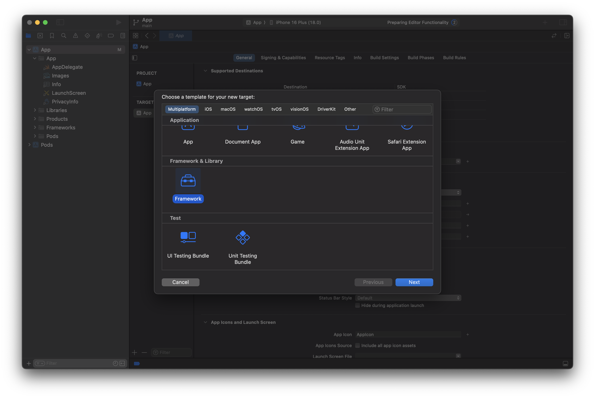

# Configuring the App for Brownfield Distribution

RNEF is able to build all the React Native code and bundle them into a single consumable file. This file is a `.xcframework` file for Apple platforms and `.aar` file for Android.

To be able to set this up, follow these steps:

## iOS

### 1. New Framework Target in the Xcode Workspace:

1. Open `ios/<project_name>.xcworkspace` using Xcode
1. Add a new target and pick the `Framework` template
   
1. Make sure to give the library a distinct name. This name will be used when you import the library in native apps.
1. Right click to the generated framework folder and pick `Convert to Group`. Cocoapods doesn't work properly with references.
   
1. Apply the following build settings to the generated framework target:

   | Build Setting                   | Value | Description                                                                                                                                                                                                      |
   | ------------------------------- | ----- | ---------------------------------------------------------------------------------------------------------------------------------------------------------------------------------------------------------------- |
   | Build Libraries for Distibution | YES   | This generates a module interface for you from your swift module. Also the swift compiler will throw if you try to consume the xcframework with an older version of xcode.                                       |
   | User Script Sandboxing          | NO    | Xcode normally sandboxes the scripts so you cannot modify files. We need this to be disabled to generate the js bundle later on                                                                                  |
   | Skip Install                    | NO    | This tells Xcode to not to generate any products. We obviously need to disable this to build our framework(s)                                                                                                    |
   | Enable Module Verifier          | NO    | When Xcode generates your framework artifacts, it tests it against a simple project to see if it can get compiled. Although useful, this adds some time to the compilation process. We can skip this altogether. |

### 2. Cocoapods Dependencies

1. Add the new framework target to `ios/Podfile` with `inherit!`:

   ```ruby
   # ios/Podfile

   target '<project_name>' do
     #...

     # Add the following lines
     target '<framework_target_name>' do
       inherit! :complete
     end

     # ...
     post_install do |installer|
   end
   ```

1. Go to `ios/` and run `pod install`

### 3. Script Phase for Bundling React Native Code and Images

1. Go to the app target's Build Phases
1. Expand the `Bundle React Native code and images` step and copy the code
1. Go to the library target's Build Phases
1. Hit the plus button on the top left and select `New Run Script Phase`
1. Paste the script to the new script phase and rename the phase to `Bundle React Native code and images`
1. Add `$(SRCROOT)/.xcode.env.local` and `$(SRCROOT)/.xcode.env` into the script phase's input files

### 4. Framework's Public API

1. Create a new swift file in the generated framework folder
1. Optionally copy the template from [HelloWorldReact.swift](./packages/plugin-brownfield-ios/template/ios/HelloWorldReact/HelloWorldReact.swift) for a light abstraction

### 5. Generating the Framework Artifact

1. Add `@rnef/plugin-brownfield-ios` as a dependency
1. Register the brownfield plugin in `rnef.config.mjs`

   ```js
   // rnef.config.mjs
   // ...
   import { pluginBrownfieldIos } from '@rnef/plugin-brownfield-ios';

   export default {
     plugins: {
       // ...
       brownfieldIos: pluginBrownfieldIos(),
     },
     // ...
   };
   ```

1. Generate the framework artifact using the `rnef` cli:

   ```sh
   rnef package:ios --scheme <framework_target_name> --mode Release
   ```

### 6. Consuming the Framework Artifact

1. Drag the generated `.xcframework` file to your app
1. Drag `ios/Pods/hermes-engine/destroot/Library/Frameworks/universal/hermes.xcframework` to your app
1. Add the `window` property to your `AppDelegate` or `SceneDelegate`:

   Option 1: `AppDelegate`

   ```swift
   //  AppDelegate.swift

   @main
   class AppDelegate: UIResponder, UIApplicationDelegate {
       var window: UIWindow?

       func application(_ application: UIApplication, didFinishLaunchingWithOptions launchOptions: [UIApplication.LaunchOptionsKey: Any]?) -> Bool {
           window = UIWindow(frame: UIScreen.main.bounds)
           // ...
       }

       // ...
   }
   ```

   Option 2: `SceneDelegate`

   ```swift
   //  SceneDelegate.swift
   class SceneDelegate: UIResponder, UIWindowSceneDelegate {
       var window: UIWindow?

       func scene(
           _ scene: UIScene, willConnectTo _: UISceneSession,
           options _: UIScene.ConnectionOptions
       ) {
           guard let windowScene = (scene as? UIWindowScene) else { return }

           window = UIWindow(windowScene: windowScene)

           let customViewController = CustomViewController()

           window.rootViewController = customViewController
           window.makeKeyAndVisible()
       }
   }
   ```

1. Load the React Native view:

   ```swift
   //  MyViewController.swift
   import UIKit
   import <framework_target_name>React

   class ViewController: UIViewController {
       override func viewDidLoad() {
           super.viewDidLoad()
           do {
               view = try PackageReactNativeManager().loadView(
                   moduleName: "TemplateTest",
                   initialProps: nil,
                   launchOptions: nil
               )
           } catch {
               #warning("TODO: Handle React Native loading failures")
           }
       }
   }
   ```

---

## Android

**TBD**
